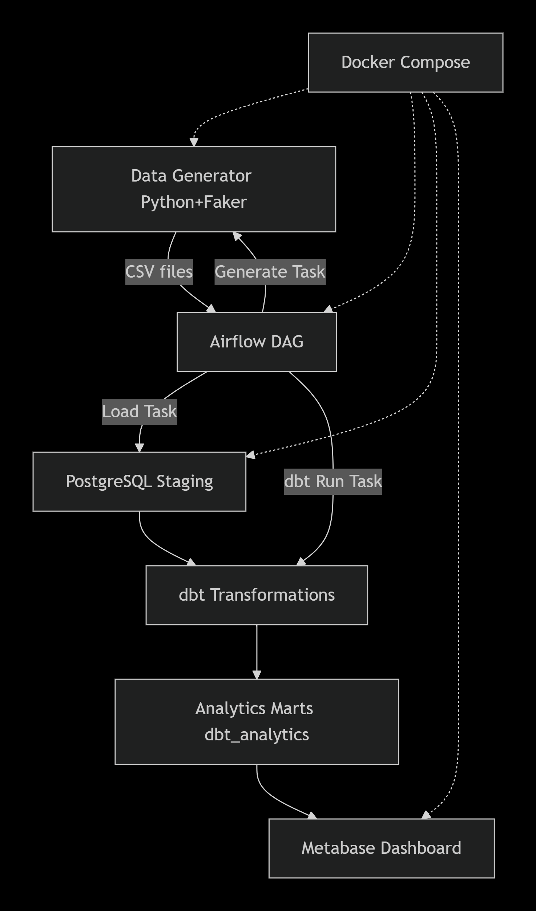

# E-commerce Data Pipeline

Сквозной проект по построению аналитического конвейера для интернет‑магазина: от генерации синтетических данных до визуализации бизнес‑метрик.

## 🎯 Цель
Создать максимально приближенный к реальности ETL/ELT-пайплайн, который включает:
- **Генератор синтетических данных** (пользователи, сессии, корзины, заказы, платежи)
- **Оркестрацию** (Apache Airflow)
- **Трансформации** (dbt)
- **Визуализацию** (Metabase)

Проект выполняется в рамках подготовки к позиции **Junior+/Middle Data Engineer / Analytics Engineer**.

## 🛠️ Стек
- Python 3 (Faker, Pandas, NumPy)
- PostgreSQL
- Docker, Docker Compose
- Apache Airflow
- dbt Core
- Metabase
- Git, GitHub
- SQLAlchemy, psycopg2-binary

## 🏗️ Архитектура


## 📁 Структура репозитория
```
ecommerce-data-pipeline/
├── airflow/dags/ # DAG для Airflow
├── generator/ # Генератор синтетических данных
│ ├── config.py
│ ├── dimensions.py
│ ├── facts.py
│ └── generate.py
├── scripts/
│ ├── load_to_db.py # загрузка CSV в PostgreSQL
│ └── validate_db.py # валидация данных
├── dbt/ecommerce_analytics/ # dbt-проект (модели, тесты, документация)
├── data/raw/ # Сгенерированные CSV (игнорируются Git)
├── docker/ # Docker Compose и Dockerfile
├── sql/ # DDL для staging-таблиц
├── images/ # Скриншоты для README
├── README.md
├── requirements.txt
└── .gitignore
```
## 🚀 Быстрый старт (полный пайплайн)

### 1. Клонируйте репозиторий
```bash
git clone https://github.com/<your-username>/ecommerce-data-pipeline.git
cd ecommerce-data-pipeline
```

### 2. Настройте виртуальное окружение (опционально, для локальной разработки)
```bash
python -m venv venv
source venv/bin/activate        # Linux/Mac
venv\Scripts\activate           # Windows
pip install -r requirements.txt
```

### 3. Запустите генератор (локально, если нужно)
```bash
python generator/generate.py
```
Скрипт создаст CSV‑файлы в папке ```data/raw/``` (файлы исключены из Git).

### 4. Запустите всю инфраструктуру через Docker Compose
Убедитесь, что Docker запущен, затем выполните из папки docker/:
```bash
cd docker
docker-compose up -d
```
Это поднимет:
- PostgreSQL (порт 5432 внутри сети, 5430 на хосте)
- Airflow (веб-интерфейс на http://localhost:8080, логин/пароль admin/admin)
- Metabase (веб-интерфейс на http://localhost:3000)

### 5. Создайте таблицы в PostgreSQL
Выполните DDL-скрипт из корня проекта:
```bash
docker exec -i ecommerce_container psql -U postgres_user -d postgres_db < sql/create_tables.sql
```
База данных будет доступна на порту 5430 (пользователь: ```postgres_user```, пароль: ```postgres_password```, база: ```postgres_db```).
Базы данных `airflow_db`, `metabaseappdb` и пользователь `metabase` создаются автоматически при первом запуске PostgreSQL благодаря скрипту `docker/initdb/init.sql`.

### 6. Запустите пайплайн в Airflow
1. Откройте http://localhost:8080, войдите (admin/admin).
2. Включите DAG ecommerce_pipeline.
3. Запустите его вручную (Trigger DAG) или дождитесь выполнения по расписанию.
4. DAG выполнит три шага:
   - generate_data – генерация CSV
   - load_to_db – загрузка в PostgreSQL
   - dbt_run – построение витрин dbt

### 7. Проверьте качество данных (опционально, локально)
```bash
python scripts/validate_db.py
```

### 8. Исследуйте витрины в Metabase
1. Откройте http://localhost:3000.
2. Пройдите первоначальную настройку (создайте аккаунт администратора).
3. На шаге "Add your data" выберите **PostgreSQL** и заполните поля:
   - **Name**: Ecommerce Analytics
   - **Host**: postgres
   - **Port**: 5432
   - **Database name**: postgres_db
   - **Username**: postgres_user
   - **Password**: postgres_password
4. После подключения перейдите в "Browse Data" → схема `dbt_analytics`. Здесь находятся все витрины (`fct_*`).
5. Создайте вопросы и дашборд на основе этих таблиц.
   **Здесь вставьте скриншот дашборда Metabase**


## 📊 Схема данных
Сгенерированные таблицы и их основные поля:

- **dim_users** – пользователи (user_id, name, email, registration_date, city, state)
- **dim_products** – товары (product_id, product_name, category, subcategory, base_price)
- **fct_sessions** – сессии пользователей на сайте (session_id, user_id, start_time, end_time, device_type, utm_source)
- **fct_carts** – корзины (cart_id, user_id, session_id, created_time)
- **fct_cart_items** – товары в корзинах (cart_id, cart_item_id, product_id, quantity, added_time)
- **fct_orders** – заказы (order_id, user_id, cart_id, order_time, status)
- **fct_payments** – платежи (payment_id, order_id, amount, payment_time, method)

Связи: users → sessions → carts → orders → payments; carts → cart_items ← products.

## 🧪 dbt: трансформации и качество
dbt-проект включает:
- staging-модели – представления над сырыми таблицами.
- intermediate-модели – обогащённые заказы и сессии с флагами конверсии.
- marts-витрины – финальные таблицы для BI:
  - fct_daily_revenue – дневная выручка с накопительным итогом
  - fct_monthly_revenue_growth – месячная выручка и прирост
  - fct_top_products – топ-5 товаров по категориям
  - fct_cohort_retention – когортный анализ удержания
  - fct_conversion_funnel – воронка конверсии по неделям

Добавлены тесты на уникальность, not_null, accepted_values.


## 📈 Аналитика и инсайты
На основе построенных витрин можно ответить на ключевые бизнес-вопросы:
- Как менялась выручка по дням и месяцам? Есть ли сезонность?
- Какие категории товаров приносят наибольшую выручку? Кто лидеры в каждой?
- Какая конверсия из сессии в заказ? На каком этапе теряем клиентов?
- Какой процент клиентов возвращается? (когортный анализ)
- Какой средний чек и как он меняется?

## 📦 Production-заметки
В текущей версии проект оптимизирован для локальной демонстрации. При переводе в production рекомендуется:
- Вынести параметры подключения в .env файл.
- Использовать объектное хранилище (MinIO/S3) для CSV.
- Заменить BashOperator на PythonOperator или DockerOperator.
- Добавить CI/CD пайплайн с тестированием dbt-моделей.

## 📈 План развития
- [x] Модель данных и конфигурация генератора
- [x] Реализация генератора синтетических данных
- [x] Staging‑слой и загрузка в PostgreSQL
- [x] Оркестрация пайплайна в Airflow
- [x] Трансформации dbt и построение витрин
- [x] Дашборд в BI‑инструменте
- [x] Документирование и публикация

## 📬 Контакты
  - Автор: Константин Панарин
  - Email: [goduskospan@gmail.com](mailto:goduskospan@gmail.com)
  - GitHub: https://github.com/kostant25
